# CRD Generator Maven Plugin


1. The CRD-Generator Maven Plugin determines first it's configuration by reading various settings.
2. If no Custom Resource classes are provided via the the config, the _collector_ is used to find Custom Resource classes in a defined _scan scope_. The scan scope must be part of the configured classpath.
3. The given Custom Resource classes and the corresponding dependent java classes are now loaded via the _ClassLoader_.
4. Finally, the loaded classes are used by the _crd-generator-v2_ to create the CRDs.


## Collector

The collector solves the problem of _finding_ Custom Resource classes. It uses jandex to build in the first step an in-memory index of all classes in the _scan scope_.
In the second step, it uses this index to find Custom Resource classes in an efficient way.

### Scan-Scope: Project

This example shows probably the most usual project setup:

> CRDs should be generated for Custom Resource classes in the **current project**, where those classes may depend on other java classes from the project or dependencies.

In this case the default configuration for the maven plugin can be used:

```xml
<plugin>
    <groupId>io.fabric8</groupId>
    <artifactId>crd-generator-maven-plugin</artifactId>
    <executions>
        <execution>
            <goals>
                <goal>generate</goal>
            </goals>
        </execution>
    </executions>
</plugin>
```

This configuration will result in the following workflow:


1. The collector tries to find an existing jandex index (1a) first. If it doesn't exist (1b), a new index will be created which includes the project classes.
2. The existing or created index is added to the in-memory index of the collector.
3. In the last step, the collector looks up Custom Resource classes in the internal index.


### Scan-Scope: Project and Dependency

This example shows a more advanced project setup where Custom Resource classes are located in multiple places:

> CRDs should be generated for Custom Resource classes in the **current project** and for Custom Resource classes in a **specifc dependency**.

In this case the maven plugin must be configured as follows:

```xml
<plugin>
    <groupId>io.fabric8</groupId>
    <artifactId>crd-generator-maven-plugin</artifactId>
    <executions>
        <execution>
            <goals>
                <goal>generate</goal>
            </goals>
            <configuration>
                <dependenciesToScan>
                    <dependency>
                        <!-- Jar Archive 2 -->
                        <groupId>com.example</groupId>
                        <artifactId>my-custom-resources</artifactId>
                    </dependency>
                </dependenciesToScan>
            </configuration>
        </execution>
    </executions>
</plugin>
```

This configuration will result in the following workflow:



1. The collector tries to find an existing jandex index (1a) in the project. If it doesn't exist (1b), a new index will be created which includes the project classes.
2. The collector tries to find an existing jandex index (2a) in the dependency. If it doesn't exist (2b), a new index will be created which includes classes of the dependency.
3. Both, existing and created indices, are added to the in-memory index of the collector.
4. In the last step, the collector looks up Custom Resource classes in the internal index.
5. Note that Custom Resource classes of other dependencies are ignored, because they are not included in the _scan scope_.